FishDiveR Package Manual
================

<!-- README.md is generated from README.Rmd. Please edit that file -->

# FishDiveR

<!-- badges: start -->

[](https://github.com/calvinsbeale/FishDiveR/actions/workflows/R-CMD-check.yaml)
<!-- badges: end -->

The goal of FishDiveR is to provide a methodology for quantitatively
analysing time-series depth data from animal tags. Ultimately allowing
the user to cluster the data into behaviours which can be plotted and
examined further. FishDiveR allows the user to import tag data from
comma-separated-value (csv) archives which include a time-date stamp and
a depth column.

The various functions: - Import and crop the archive. - Plot the depth
time-series record. - Calculate daily and diel statistics for use in
k-means clustering. - Perform wavelet analysis using the ‘WaveletComp’
package. - Perform principal component analysis using the ‘FactoMineR’
package. - Combine PC scores and depth statistics. - Aid in the
selection of k for K-means clustering. - Perform K-means clustering. -
Plot the depth time-series record, with days coloured by cluster
assignment. - Plot the depth time-series of the days best representing
the behaviour clusters.

While the package only requires a minimum of three full days (midnight
to midnight) to run, meaningful clustering of behaviour can only occur
with a reasonable amount of data. A meaningful amount of data varies
with every individual of every species, the more complex and varied the
diving behaviours, the more days are required to accurately cluster them
into groups. Further to this, the frequency of time-series data greatly
impacts the ability of the package to infer behaviours from depth
changes. Data recorded at 1 second frequency contains much more
information to analyse than data recorded at 10 minute frequency. In
general we recommend a bare-minimum of 5 minute time series frequency,
with more active species requiring a higher frequency of data
collection.

## Installation

You can install the development version of FishDiveR from
[GitHub](https://github.com/) with:

``` r
# Development version (requires either the "remotes" or "devtools" package to install:
# install.packages("remotes") # This is an R package, smaller and easier than installing devtools 
remotes::install_github("calvinsbeale/FishDiveR")

# install.packages("devtools")
devtools::install_github("calvinsbeale/FishDiveR")

# CRAN release:
install.packages("FishDiveR")
```

## Usage

``` r
library(FishDiveR)
#> FishDiveR version 0.9.9.9. Facilitating classification of aquatic animal behaviours from vertical movement data.
#>  Type 'citation("FishDiveR")' for citing this R package in publications.
# Set file path
filepath <- system.file("extdata", package = "FishDiveR")
output_folder <- tempdir()

# Set RGL to use null device to suppress graphical output to pass CRAN checks
Sys.setenv(RGL_USE_NULL = TRUE)

# Configure R Markdown - Sets the global option to display all R code chunks in the final document.
knitr::opts_chunk$set(echo = TRUE)
```

`import_tag_data()` imports time-series depth data. Specifically, we
focus on handling csv format tag archives including at least two columns
of data, a constant time-series and a depth record. This is typically
downloaded from a tag archive. The package requires at least two full
days of data (midnight to midnight local time).

At this time the package does not work with time zones which use
daylight savings, shifts in the clock introduce inconsistent time-series
on days when time is gained or lost.

If working with multiple tags, we recommend creating a meta-data table
which can be read from for importing data. This will save time in the
long-run if you need to re-import, and help prevent accidental changing
of deployment and release times or mixing of tag data.

The processed tag data is saved in R Mark’s .rds format for faster
processing in later functions.

Including a temperature column does not impact results, there is
currently no analyses performed on temperature data.

``` r
# Import the tag data and crop to deployment times
archive_days <- import_tag_data(
  tag_ID = "data",
  tag_deploy_UTC = "2000-01-01 00:00:00",
  tag_release_UTC = "2000-01-11 23:59:00",
  archive = file.path(filepath, "data/data-Archive.csv"),
  date_time_col = 1,
  depth_col = 2,
  temp_col = NA,
  time_zone = "UTC",
  output_folder = output_folder
)
#> 
#> Tag ID = data
#> 
#> Depth sampling interval is 60 seconds 
#> 
#> Number of depth values corrected (above 0): 0 
#> Mean depth = 81.5 SD = 87.6
#> Maximum depth = 262.2
#> Number of full days in dataset: 10
#> 
#> Output file: C:\Users\User\AppData\Local\Temp\RtmpQFEUNv/data/archive_days.rds
# Plot the depth time-series record
TDR_plot <- plot_TDR(
  rds_file = "data/archive_days.rds",
  data_folder = filepath,
  every_nth = 1 * 10, # 1 minute depth sampling frequency. Plot every 10th data point = 10 minutes.
  every_s = 600,
  plot_size = c(12, 6),
  X_lim = NULL,
  Y_lim = c(0, 260, 50),
  date_breaks = "48 hour",
  output_folder = output_folder
)
#> 
#> Data sampling interval is 60 seconds
#> Plotting every 600 seconds 
#> 
#> Maximum depth is 252.5 meters
```

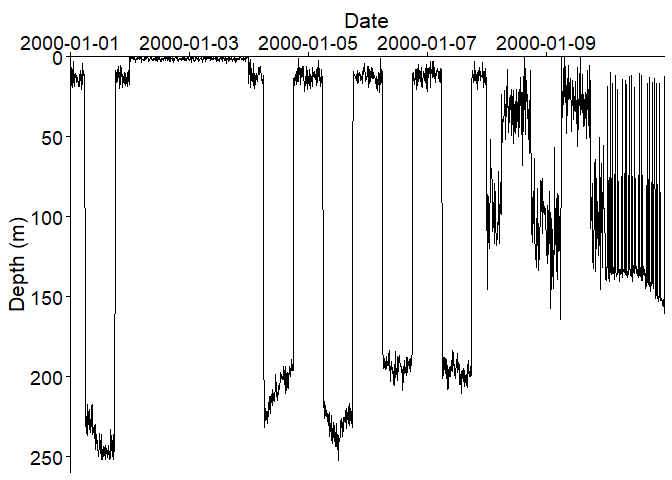

    #> 
    #> Output file: C:\Users\User\AppData\Local\Temp\RtmpQFEUNv/tag_archive.png

The `create_wavelet()` function performs wavelet analysis on the
processed tag archive using the ‘WaveletComp’ package
(`WaveletComp::analyze.wavelet()` function). The user can plot the
wavelet spectrum and mean wavelet power (`WaveletComp::wt.image()`
function).

We have endeavoured to make this process simple and allow the user to
control the key features of these functions within
`FishDiveR::create_wavelet()`. Note: interactive_mode = FALSE is only
used in the example, please leave this parameter on default (TRUE) when
processing data.

As with any wavelet transformation, there are inherent assumptions that
the user captures the important periods within their selection of lower
and upper periods. Limiting the lower and upper periods creates the
potential to miss important high-resolution and low-resolution patterns
outside of the periods chosen. For example, many aquatic species have
cycles governed by the moon phase, limiting the upper period to 24 hours
will prevent this signal from being detected by CWT.

The lower wavelet period is typically set to 5 minutes where depth
sampling frequency allows. Ensuring that shorter time period behaviours
could be accurately captured, while reducing wavelet file size. An upper
period of 24 hours is typically used to focus the analysis on daily
behaviour patterns, excluding longer-scale patterns that are not
relevant to the study’s objectives. To detect lunar cycles, sufficient
data covering the 28-day cycle must be available. To achieve a detailed
resolution of behavioural patterns, the period range was divided into
twelve sub-octaves. This division provided intervals with ecological
relevance, such as 24, 12, and 6 hours, while including 12 periods
between 24 and 12 hours to capture finer details within daily cycles.

If you have errors allocating large vectors try using library(bigmemory)
and create a big matrix with: big_mat \<- big.matrix(nrow = 1e7, ncol =
10, type = “double”) then run your code again. This allows greater range
between lower and upper periods, allowing the capture of long time-frame
changes e.g. 6 hours to 128 days.

``` r
# Create the wavelet and plot the wavelet spectrum
my.w <- create_wavelet(
  archive = archive_days,
  tag_ID = "data",
  wv_period_hours = 24,
  sampling_frequency = NULL,
  suboctaves = 12,
  lower_period_mins = 30,
  upper_period_hours = 24,
  pval = FALSE,
  output_folder = output_folder,
  plot_wavelet = TRUE,
  max_period_ticks = 10,
  plot_width = 800,
  plot_height = 400,
  interactive_mode = FALSE
)
#> 
#> Analysing tag ID data
#> 
#> No 'my.w' in global environment. 
#> Creating new wavelet.
#> Starting wavelet transformation...
#> Class attributes are accessible through following names:
#> series loess.span dt dj Wave Phase Ampl Power Power.avg Power.pval Power.avg.pval Ridge Period Scale nc nr coi.1 coi.2 axis.1 axis.2 date.format date.tz 
#> 
#> Wavelet saved to C:\Users\User\AppData\Local\Temp\RtmpQFEUNv/data/1_Wavelets/data_wavelet.rds
#> 
#> Output folder: C:\Users\User\AppData\Local\Temp\RtmpQFEUNv/data/2_Wavelet_Figures/
```

The two functions `create_wavelet_stats()` and `create_depth_stats()`
are used to create daily statistics. Data are separated into 24-hour
segments from which the statistics are created. `create_wavelet_stats()`
creates seven wavelet statistics for each 24-hour segment of the wavelet
object. `create_depth_stats()` creates 10 daily depth statistics and an
optional eight diel statistics for each 24-hour segment of depth
time-series.

``` r
# Create daily wavelet statistics
waveStats <- create_wavelet_stats(
  wavelet = my.w,
  tag_ID = "data",
  output_folder = output_folder
)
#> 
#> Running create_wavelet_stats() on tag ID data 
#> 
#> Output file: C:\Users\User\AppData\Local\Temp\RtmpQFEUNv/data/3_Stats/data_waveStats.csv
# Create daily and diel depth statistics
depthStats <- create_depth_stats(
  archive = archive_days,
  tag_ID = "data",
  diel = TRUE,
  sunrise_time = "06:00:00",
  sunset_time = "18:00:00",
  GPS = file.path(filepath, "data/GPS.csv"),
  sunset_type = "civil",
  output_folder = output_folder
)
#> 
#> Running create_depth_stats() on tag ID data 
#> Reading in GPS locations. Using actual sunrise and sunset times to calculate diel statistics
#> Archive updated with diel periods based on GPS calculated times
#> 
#> Output folder: C:\Users\User\AppData\Local\Temp\RtmpQFEUNv/data/3_Stats/data_depthStats.csv
```

Performing Principal Component Analysis (PCA). PCA is performed to
reduce the high dimensionality and collinearity resulting from having
many wavelet periods which are similar in length. PCA allows the user to
manipulate the two-dimensional matrices which are output from the
wavelet analysis. The user first selects which wavelet metrics to
include, we recommend using the three which default to TRUE (mean power,
mean amplitude, and variance of power). These are chosen to maximise the
cumulative percentage variance in the fewest resulting principal
components. When choosing the number of PC’s to keep, we recommend a
minimum of 70% cumulative variance, consult the literature in your
subject area for further information.

`pca_data()` creates a data frame containing the selected daily wavelet
metrics for the tags in the vector.

`pca_results()` performs principal component analysis and outputs the
results. The user then selects the number of PC’s to keep. Data are
standardised by default to prevent statistics with particularly large
values from impacting the results, this option can be turned off in
variables however we highly recommend leaving it on. Note: No_pcs and
PCV provide a short cut to avoid being asked to choose the number of
principal components (No_pcs) or the percentage cumulative variance
(PCV) to keep if you already know. It is recommended to leave these
variables as the default NULL unless you are re-processing data, or know
exactly how much cumulative variance you wish to keep. Note:
interactive_mode = FALSE is only used in the example, please leave this
parameter on default (TRUE) when processing data.

The function `pca_scores()` extracts the principal component scores to
be used for k-means clustering. It then plots the loadings of the
wavelet statistics on the individual PC’s. Note: interactive_mode =
FALSE is only used in the example, please leave this parameter on
default (TRUE) when processing data.

Perform Principal Component Analysis:

``` r
# List the tags to perform PCA of daily wavelet statistics
tag_list <- c("data")
# Create the data frame of wavelet statistics for all tags in tag_list. Choose which wavelet statistics to include.
pc_data <- pca_data(
  tag_vector = tag_list,
  data_folder = filepath,
  phase_mean = FALSE,
  phase_variance = FALSE,
  power_mean = TRUE,
  power_variance = TRUE,
  mean_sq_power = FALSE,
  amplitude_mean = TRUE,
  amplitude_variance = FALSE,
  output_folder = output_folder
)
#> 
#> Output file: C:\Users\User\AppData\Local\Temp\RtmpQFEUNv/data/4_PCA/pc_data.rds
# Run Principal Component Analysis on the data frame to calculate PC scores
pc_results <- pca_results(
  pc_data = pc_data,
  standardise = TRUE,
  No_pcs = 3,
  PCV = 90,
  plot_eigenvalues = TRUE,
  output_folder = output_folder
)
#> 
#> Non-numerical columns being excluded:
#> [1] "tag_ID"    "date_only"
#>        eigenvalue percentage of variance cumulative percentage of variance
#> comp 1 142.382404             47.9402034                          47.94020
#> comp 2 103.975584             35.0086141                          82.94882
#> comp 3  25.966874              8.7430553                          91.69187
#> comp 4  12.222732              4.1153979                          95.80727
#> comp 5   7.276460              2.4499865                          98.25726
#> comp 6   3.341829              1.1251948                          99.38245
#> comp 7   1.225305              0.4125604                          99.79501
#> 
#> 7 principal components of 9 have eigenvalues >= 1 
#> 
#> Output file: C:\Users\User\AppData\Local\Temp\RtmpQFEUNv/data/4_PCA/eigenvalues_cum_var.csv
#> Using cumulative variance threshold: Keeping 3 principal components to reach 90 % variance
```

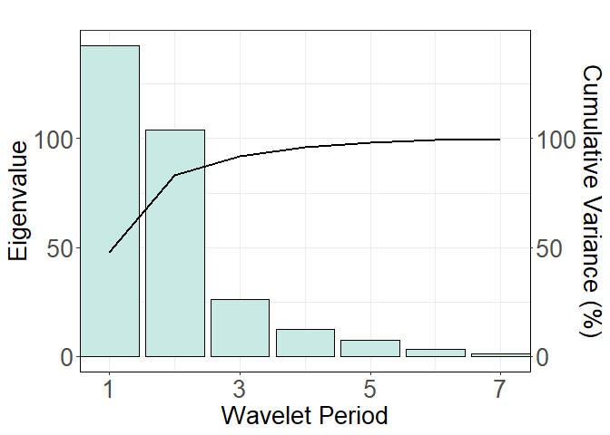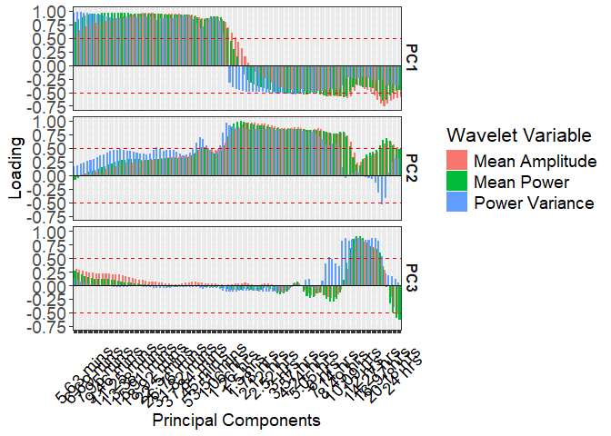

    #> Output folder: C:\Users\User\AppData\Local\Temp\RtmpQFEUNv/data/4_PCA 
    #> 
    #> Output file: C:\Users\User\AppData\Local\Temp\RtmpQFEUNv/data/4_PCA/pc_results.rds contains the selected number of principal components.
    # Extract the principal component scores.
    pc_scores <- pca_scores(
      pc_results = pc_results,
      plot_loadings = TRUE,
      output_folder = output_folder
    )

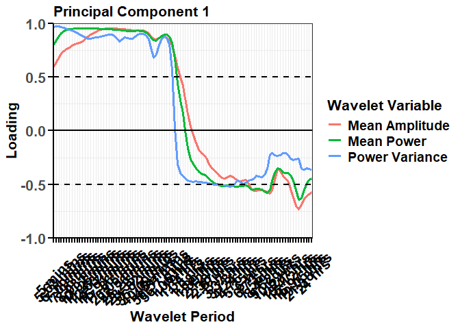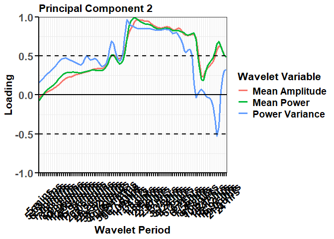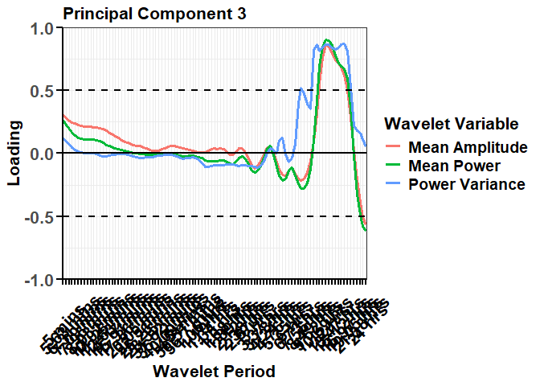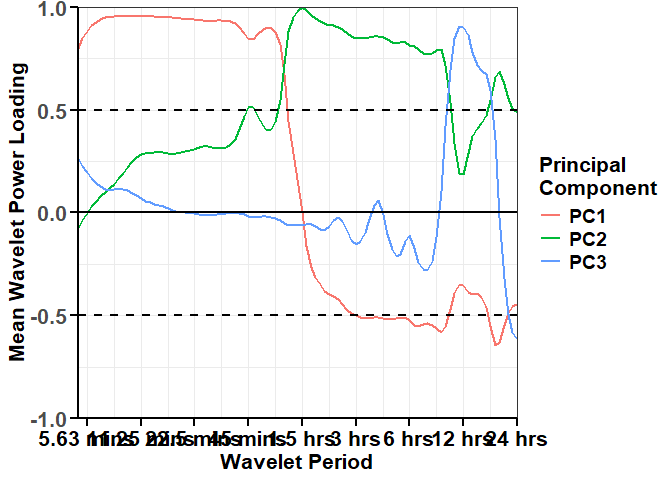

    #> 
    #> Output folder: C:\Users\User\AppData\Local\Temp\RtmpQFEUNv/data/4_PCA
    #> 
    #> Output file: C:\Users\User\AppData\Local\Temp\RtmpQFEUNv/data/4_PCA/pc_scores.rds

The PC scores and depth statistics calculated from the raw tag data are
combined prior to clustering. `combine_data()` loads the depth
statistics of each tag in the vector and combines it with the PC scores.

``` r
# Import the depth statistics for tags in tag_vector, combine them with pc_scores and standardise
kmeans_features <- combine_data(
  tag_vector = tag_list,
  data_folder = filepath,
  pc_scores = pc_scores,
  output_folder = output_folder
)
#> 
#> Saving combined metrics to: C:\Users\User\AppData\Local\Temp\RtmpQFEUNv/data/5_k-means/combined_stats.rds
# Optionally at this stage the user may select to remove or add additional statistics. If data are modified, be sure to re-standardise the data frame.
# kmeans_features <- kmeans_features[,c(1:8, 10:20)]
```

K-means clustering is performed on the combined ‘kmeans_data’ data
frame. This data frame should be standardised. `select_k()` runs k-means
on all values of k from 2 to Max.k, and outputs a combined figure of the
within-cluster sum of squared errors (elbow) and silhouette widths.
‘V_line’ may be used to plot a vertical red line on a selected value of
K, it defaults to ‘NULL’. The two plots inform the users decision on the
value of k to use.

`k_clustering()` performs k-means clustering with the pre-chosen value
of k on the combined data frame. It plots the mean values of the
variables which influence each cluster and outputs a 3-dimensional plot
of the days on the axis of PC1, PC2, and PC3 to visualise how the data
is spread amongst them.

Perform K-means clustering:

``` r
# Plot elbow and silhouette width plots to inform the value of k to use (number of clusters)
selecting_k <- select_k(
  kmeans_data = kmeans_features,
  standardise = TRUE,
  Max.k = 8,
  v_line = 4,
  calc_gap = FALSE,
  plot_gap = FALSE,
  output_folder = output_folder
)
#> 
#>  Standardising k-means input. 
#> 
#>  K = 2 Average silhouette width = 0.499
#> 
#> 1 2 
#> 5 5 
#> 
#>  K = 3 Average silhouette width = 0.586
#> 
#> 1 2 3 
#> 5 2 3 
#> 
#>  K = 4 Average silhouette width = 0.642
#> 
#> 1 2 3 4 
#> 2 2 5 1 
#> 
#>  K = 5 Average silhouette width = 0.518
#> 
#> 1 2 3 4 5 
#> 2 3 1 2 2 
#> 
#>  K = 6 Average silhouette width = 0.392
#> 
#> 1 2 3 4 5 6 
#> 1 1 3 1 2 2 
#> 
#>  K = 7 Average silhouette width = 0.243
#> 
#> 1 2 3 4 5 6 7 
#> 1 3 2 1 1 1 1 
#> 
#>  K = 8 Average silhouette width = 0.154
#> 
#> 1 2 3 4 5 6 7 8 
#> 1 1 1 1 3 1 1 1
#> Single tag output file: C:\Users\User\AppData\Local\Temp\RtmpQFEUNv/data/5_k-means/Select_k.3_PCs.png
```

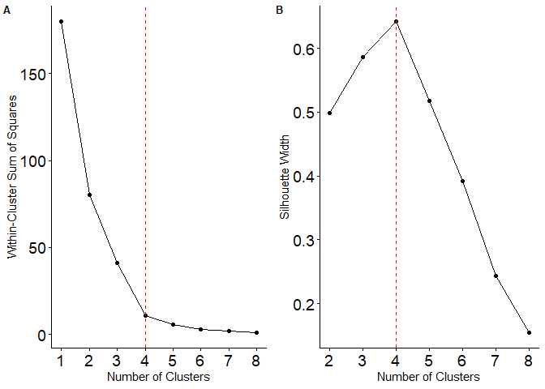

``` r
# Run k-means with the selected number of clusters
kmeans_result <- k_clustering(
  kmeans_data = kmeans_features,
  standardise = TRUE,
  k = 4,
  polygon = TRUE,
  output_folder = output_folder
)
#> 
#>  Standardising k-means input. 
#>   Cluster Days in Cluster
#> 1       1               2
#> 2       2               1
#> 3       3               2
#> 4       4               5
#> [1] "Total of 10 days of data"
#>   tag_ID cluster days_in_cluster
#> 1   data       1               2
#> 2   data       2               1
#> 3   data       3               2
#> 4   data       4               5
#> Output folder: C:\Users\User\AppData\Local\Temp\RtmpQFEUNv/data/5_k-means
```

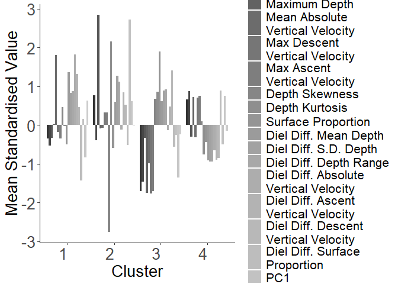
Note: After clustering, the user may find the mean standardised values
plot hard to interpret due to one cluster vastly different to the
others. This may happen if the animal is captured during tag deployment,
or performs an ‘extreme’ movement pattern such as unusually fast deep
dive - common in most large marine predators. In this case, you may wish
to plot the k-means features with a split y-axis or remove this day’s
statistics from the k-means features.

Plot the depth time-series. Each 24-hour segment is coloured by its
cluster assignment, matching previous plots. ‘every_nth’ allows you to
control the frequency of records used, alternatively use ‘every_s’ to
control the number of seconds between records.

``` r
# Plot the depth time-series record with each day coloured by the cluster assignment
TDR_plot <- plot_cluster_TDR(
  tag_ID = "data",
  data_folder = filepath,
  kmeans_result = kmeans_result,
  every_nth = 10,
  every_s = 600,
  X_lim = NULL,
  Y_lim = c(0, 275, 75),
  date_breaks = "24 hour",
  legend = TRUE,
  plot_size = c(12, 6),
  dpi = 100,
  output_folder = output_folder
)
#> 
#>  Loading tag data TDR 
#> 
#>  Single tag k-means loaded 
#> 
#> Maximum depth is 262.2
#> Data sampling interval is 60 seconds
#> Plotting every 600 seconds
```

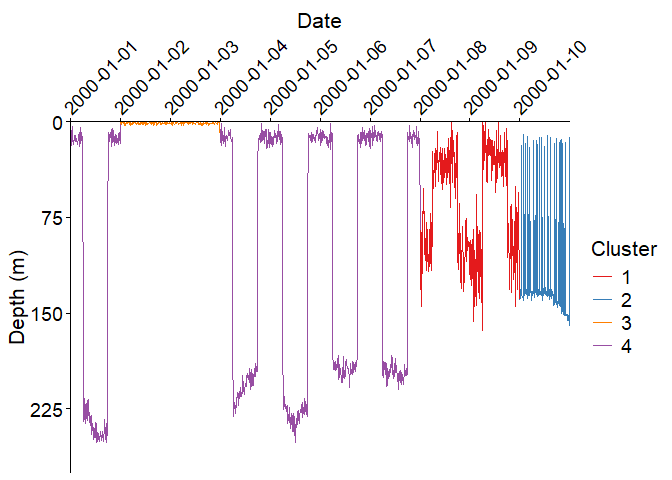

    #> 
    #>  Output file: C:\Users\User\AppData\Local\Temp\RtmpQFEUNv/data_TDR_k=4.png

Plot the depth time-series of the 24-hour segments closest to the centre
of each cluster group. ‘No_days’ allows you to choose the number of
example segments (days) to display. Each 24-hour segment is coloured by
its cluster assignment, matching previous plots. ‘every_nth’ allows you
to control the frequency of records used, alternatively use ‘every_s’ to
control the number of seconds between records.

``` r
# Plot the 24-hour depth time-series of the 'No_days' closest to the centre of each cluster group
plots_list <- plot_clusters(
  tag_vector = "data",
  data_folder = filepath,
  kmeans_result = kmeans_result,
  No_days = 1,
  every_nth = 10,
  every_s = 300,
  Y_lim = c(0, 275, 50),
  color = TRUE,
  diel_shade = TRUE,
  dpi = 100,
  output_folder = output_folder
)
#> 
#> Maximum depth is 262.2
#> Data sampling interval is 60 seconds
#> Plotting every 300 seconds 
#> 
#>  Cluster 1 dates 2000-01-08 Tag: data
#> 
#>  Cluster 2 dates 2000-01-10 Tag: data
#> 
#>  Cluster 3 dates 2000-01-03 Tag: data
#> 
#>  Cluster 4 dates 2000-01-04 Tag: data
#> Output folder: C:\Users\User\AppData\Local\Temp\RtmpQFEUNv/data/6_Cluster-plots.K=4_shaded
```

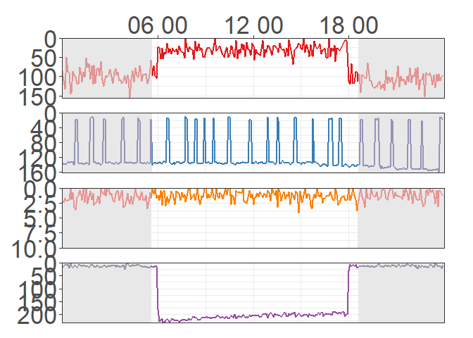
